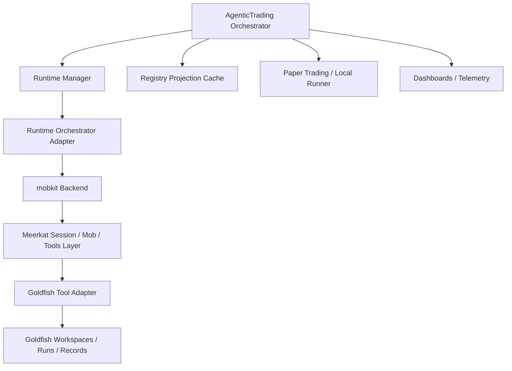

# AgenticTrading Refactor Overview
## Target state: mobkit-orchestrated, Meerkat-powered, Goldfish-recorded autonomy

## Purpose

This document defines the target architecture for refactoring AgenticTrading into a production-grade autonomous research factory where:

- **meerkat-mobkit** is the **canonical runtime orchestrator backend** for multi-agent execution.
- **Meerkat** is the **agent harness / session / tool / schema / sub-agent capability layer**.
- **Goldfish** is the **experiment execution, provenance, reproducibility, and durable research-memory layer**.
- **AgenticTrading** remains the **domain control plane** responsible for strategy-family policy, lineage lifecycle, promotion/retirement decisions, backtest interpretation, paper-trading hooks, operator-facing dashboards, and factory governance.

The design goal is not “add three repos side by side.” The design goal is **clear separation of concerns**, a **single execution path**, **strict cost control**, and **reproducible experiment lineage**.

This pack is written so a coding agent can implement the system in bounded phases without rewriting the entire repo in one pass.

---

## Current-state problem statement

The current factory is functional as a standalone system, but the desired backbone is not implemented as requested:

1. **Goldfish is not the real experiment engine today.**
   The current codebase uses local scaffolding and JSON/JSONL persistence, but does not rely on Goldfish as the canonical experiment/provenance backend.

2. **Meerkat is not the runtime orchestrator today.**
   The current factory runtime relies on direct provider calls and/or CLI-driven execution patterns instead of a first-class Meerkat-anchored orchestration layer.

3. **meerkat-mobkit must become the canonical runtime backend.**
   The refactor must ensure all agentic factory work routes through one orchestrator boundary rather than mixing ad hoc execution paths.

4. **Current “multi-agent” behavior is too close to prompt choreography.**
   Production autonomy requires explicit orchestration objects, role isolation, per-member budgets, retries, failure handling, task boards, and run metadata.

5. **Cost control is incomplete.**
   Current cost governance should evolve into hard ceilings and deterministic downgrade paths at the global, family, lineage, task, and mob-member levels.

---

## Architectural principles

### 1) One canonical execution path
All LLM-driven research activity must flow through:

`AgenticTrading -> Runtime Orchestrator Adapter -> mobkit backend -> Meerkat sessions/tools/subagents -> Goldfish tools/records`

No hidden direct provider calls in business logic.
No parallel “temporary” path left active after cutover, except an explicitly gated legacy fallback.

### 2) One canonical provenance path
Every experiment-like action must produce durable lineage:

- proposal context
- hypothesis / mutation rationale
- model code hash
- parameter genome
- dataset identity
- backtest artifacts
- execution logs
- evaluation summary
- promotion / retirement decision
- cost and usage metadata

Goldfish is the durable system of record for this experiment lineage. AgenticTrading may cache summaries and dashboards, but should not be the authoritative history after migration.

### 3) Orchestration must be explicit
The factory must model agent work as named runtime tasks with:

- role
- input contract
- output schema
- tool scope
- model tier
- budget ceilings
- retry policy
- fallback policy
- observability labels

### 4) Cost control is a first-class design constraint
The system must assume that autonomous loops can overspend if unconstrained. Budgeting is not advisory. It must be enforced in runtime selection, orchestration policy, and fallback logic.

### 5) Migration must be reversible
Every phase must leave the repo in a runnable state.
Each phase must have a rollback path that restores previous behavior behind feature flags.

---

## Target responsibility split

## AgenticTrading responsibilities

AgenticTrading remains responsible for:

- family definitions and policy
- lineage generation and mutation strategy
- selection / promotion / retirement rules
- evaluation interpretation
- paper-trading and runner integration
- dashboard / operator views
- governance policy
- migration feature flags
- local summary projections for fast UI access

AgenticTrading should **not** be responsible for:

- direct multi-agent session orchestration logic
- custom ad hoc agent lifecycle plumbing
- durable experiment database behavior
- custom provenance protocol design when Goldfish already provides it

## meerkat-mobkit responsibilities

mobkit is the canonical runtime orchestrator backend responsible for:

- team / mob lifecycle
- runtime DAG or task-board execution
- role scheduling
- inter-member coordination
- execution state transitions
- runtime-level retries and cancellation
- member-level failure handling
- shared run context and orchestration metadata
- orchestration packaging and reproducible runtime deployment target

The implementation must assume mobkit owns orchestration semantics and AgenticTrading consumes it through an adapter boundary.

## Meerkat responsibilities

Meerkat provides the agent harness layer used underneath the orchestration backend:

- provider abstraction
- structured output
- tool execution
- sub-agents
- agent sessions and memory hooks
- MCP integration
- budget enforcement hooks
- runtime surfaces (CLI / JSON-RPC / SDKs)

The refactor must not bypass Meerkat from business logic once the runtime backend is in place.

## Goldfish responsibilities

Goldfish is responsible for:

- workspaces
- experiment runs
- record history
- provenance
- result finalization
- durable research memory / notes / patterns
- tagging and record inspection
- reproducible execution semantics

---

## Target control-plane layers

---

## Major architecture deltas from current state

## Delta A: introduce a runtime adapter boundary
Create a hard interface between the factory and any orchestration implementation.

The factory must never call provider SDKs or CLI binaries directly in business logic once this boundary exists.

## Delta B: make mobkit canonical
A concrete `MobkitOrchestratorBackend` becomes the default runtime engine.

The backend may internally use Meerkat SDK / RPC / runtime services, but AgenticTrading must treat mobkit as the runtime orchestrator.

## Delta C: move “multi-agent” from prompting to orchestration
Current prompt-level decomposition must be replaced by explicit runtime plans:

- proposal mob
- critique mob
- mutation mob
- maintenance diagnosis mob
- promotion-review mob

Each pattern must have named roles and capped member budgets.

## Delta D: make Goldfish authoritative for experiment lineage
Local JSONL learning memory remains only as a short-term projection cache during migration. Long term, it becomes a derivative view.

## Delta E: add hard budget governance
Introduce cost policy objects and circuit breakers before enabling full autonomy.

## Delta F: add observability before cutover
You do not cut over to a new runtime until:

- run IDs are traceable across layers
- member usage is visible
- Goldfish record IDs are correlated
- fallback reasons are logged
- budget-triggered downgrades are measurable

---

## Canonical runtime patterns to implement

## Pattern 1: Proposal mob
Purpose: generate new strategy-family proposals or lineage mutations.

Typical members:
- Lead Researcher
- Cheap Critic
- Feasibility Reviewer
- Cost Guard / Policy Referee

Outputs:
- structured hypothesis
- risk notes
- proposed model family
- expected validation plan
- estimated cost envelope

## Pattern 2: Model design mob
Purpose: create or mutate Python model code.

Typical members:
- Code Author
- Static Reviewer
- Simplification Reviewer
- Testing Reviewer

Outputs:
- complete Python module
- schema-validated metadata
- code hash
- minimal tests or compatibility notes

## Pattern 3: Post-evaluation critique mob
Purpose: interpret backtest results and decide whether to tweak, retire, or promote.

Typical members:
- Performance Analyst
- Robustness Critic
- Overfitting Skeptic
- Portfolio / Market Microstructure Sanity Reviewer

Outputs:
- structured diagnosis
- suggested parameter changes
- retirement / continue / promote recommendation
- confidence and rationale

## Pattern 4: Maintenance / failure diagnosis mob
Purpose: determine whether failures are code, data, environment, or orchestration issues.

Typical members:
- Runtime Triage
- Data Integrity Reviewer
- Tooling / Infra Reviewer

Outputs:
- root-cause classification
- immediate remediation
- retry safety decision
- escalation severity

---

## Migration policy

The migration must occur in seven bounded tasks:

1. Runtime adapter scaffolding
2. Goldfish client integration
3. mobkit backend integration
4. Cost policy enforcement
5. Observability and correlation
6. Cutover and fallback cleanup
7. Acceptance testing and hardening

No task should attempt the full end-to-end refactor in one pass.

---

## Non-negotiable implementation rules

- Do not invent mobkit, Meerkat, or Goldfish APIs. Inspect the installed repos and adapt the boundary.
- Do not remove the legacy runtime path until the new path passes smoke tests.
- Do not merge any phase without updated tests.
- Do not keep silent direct provider calls in business logic after cutover.
- Do not treat JSONL memory as the long-term experiment source of truth.
- Do not let cheap reviewers mutate code directly unless the policy explicitly permits it.
- Do not enable recursive mob spawning.
- Do not allow unbounded tool access for subordinate members.
- Do not let the factory continue autonomous creation after hard global budget breach.

---

## High-level phase summary

## Phase 1: boundaries and flags
Deliver interfaces, config, and tests without changing behavior by default.

## Phase 2: Goldfish integration
Deliver authoritative experiment record plumbing with minimal behavior change.

## Phase 3: mobkit orchestration
Deliver real orchestrated runtime patterns behind feature flags.

## Phase 4: cost governance
Add budget ceilings, downgrade logic, and circuit breakers.

## Phase 5: observability
Add trace correlation, run metadata, and operator visibility.

## Phase 6: controlled cutover
Switch default runtime to mobkit backend with rollback switch retained.

## Phase 7: hardening
Close acceptance gaps, remove dead paths, document operations.

---

## Definition of success

This refactor is successful when:

- AgenticTrading no longer depends on ad hoc direct runtime calls for core factory behavior.
- mobkit is the default runtime orchestrator used for multi-agent factory work.
- Meerkat remains the underlying harness and tooling substrate.
- Goldfish is the durable experiment lineage system of record.
- Cost policy is enforced, visible, and test-covered.
- One autonomous cycle can be executed with traceable run IDs and deterministic rollback behavior.
