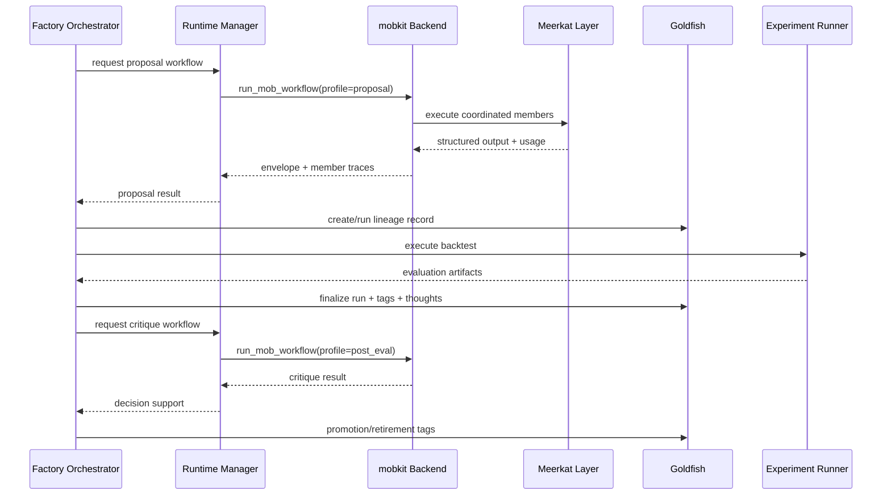

# Detailed Implementation Plan
## Codex-ready file-by-file refactor blueprint

## Scope

This document defines the concrete implementation plan for migrating AgenticTrading to:

- **mobkit as the runtime orchestrator backend**
- **Meerkat as the agent harness layer**
- **Goldfish as the experiment/provenance layer**

This is written for an implementation agent operating directly on the repo. It is intentionally explicit about boundaries, file ownership, migration sequencing, and rollback points.

---

## Assumptions

- Existing AgenticTrading files such as `factory/orchestrator.py`, `factory/agent_runtime.py`, `factory/goldfish_bridge.py`, `factory/experiment_runner.py`, `factory/registry.py`, and configuration modules remain the starting point.
- The implementation agent must inspect the actual repos for `lukacf/meerkat-mobkit`, `lukacf/meerkat`, and `lukacf/goldfish` and map these design boundaries to their real APIs.
- If an expected API is absent, the boundary remains the same; only the adapter internals change.

---

## Refactor strategy

The implementation is divided into three categories of change:

1. **New abstractions**  
   Runtime, orchestration, provenance, policy, telemetry.

2. **Bridging changes**  
   Temporary compatibility layers preserving current behavior until cutover.

3. **Behavioral cutover**  
   Defaulting the factory to the new backend and reducing legacy paths.

---

## New modules to add

Create the following modules unless equivalent folders already exist.

```text
factory/runtime/
    __init__.py
    agent_runtime_base.py
    runtime_manager.py
    orchestrator_backend.py
    mobkit_backend.py
    legacy_runtime.py
    runtime_contracts.py

factory/provenance/
    __init__.py
    goldfish_client.py
    goldfish_mapper.py
    lineage_projection.py

factory/governance/
    __init__.py
    cost_policy.py
    budget_ledger.py
    downgrade_policy.py
    safety_circuit.py

factory/telemetry/
    __init__.py
    trace_context.py
    usage_events.py
    run_logger.py
    correlation.py

factory/contracts/
    __init__.py
    runtime_schemas.py
    telemetry_schemas.py
    goldfish_schemas.py
```

These module names are recommendations. If the repo already has equivalent packages, use them instead of duplicating structure.

---

## Existing files to modify

At minimum, inspect and likely modify:

- `factory/orchestrator.py`
- `factory/agent_runtime.py` or its replacement split
- `factory/goldfish_bridge.py`
- `factory/experiment_runner.py`
- `factory/registry.py`
- config / settings / env-loading files
- smoke scripts or CLI entrypoints
- dashboard / status views
- test harness and smoke test utilities

---

## Core interfaces

## 1. Agent runtime interface

Create `factory/runtime/agent_runtime_base.py`.

```python
class AgentRuntime(Protocol):
    def generate_proposal(...): ...
    def generate_family_proposal(...): ...
    def suggest_tweak(...): ...
    def critique_post_evaluation(...): ...
    def diagnose_bug(...): ...
    def resolve_maintenance_item(...): ...
    def design_model(...): ...
    def mutate_model(...): ...
```

### Requirements
- Preserve current business-level method semantics so orchestrator code migration is incremental.
- Every return path must carry:
  - provider/backend name
  - model / profile
  - success flag
  - structured payload
  - usage and cost metadata
  - trace IDs
  - fallback reason, if any

### New shared result envelope

Create `factory/runtime/runtime_contracts.py` with dataclasses or Pydantic models such as:

- `RuntimeUsage`
- `RuntimeBudgetDecision`
- `RuntimeMemberTrace`
- `AgentRunEnvelope`

Recommended fields:

```python
run_id: str
trace_id: str
backend: str
provider: str | None
model: str | None
task_type: str
success: bool
payload: dict
raw_text: str | None
usage: RuntimeUsage | None
member_traces: list[RuntimeMemberTrace]
budget_decision: RuntimeBudgetDecision | None
fallback_reason: str | None
started_at: datetime
finished_at: datetime
```

---

## 2. Orchestration backend interface

Create `factory/runtime/orchestrator_backend.py`.

```python
class OrchestratorBackend(Protocol):
    def run_structured_task(...): ...
    def run_mob_workflow(...): ...
    def cancel_run(...): ...
    def healthcheck(...): ...
```

### Purpose
This is the boundary that makes mobkit replaceable and keeps AgenticTrading from coupling directly to a single external API.

### Required semantics

`run_structured_task(...)`
- single structured response
- schema enforcement
- no multi-member fanout required

`run_mob_workflow(...)`
- named workflow
- role definitions
- per-role budgets
- tool scopes
- shared context
- structured final output
- member traces returned

`cancel_run(...)`
- cooperative cancellation for long-running autonomous loops

`healthcheck(...)`
- verifies backend connectivity and capability surface at startup

---

## 3. Goldfish client interface

Create `factory/provenance/goldfish_client.py`.

```python
class GoldfishClient:
    def ensure_project(self, project_root: Path) -> None: ...
    def ensure_daemon(self) -> None: ...
    def create_workspace(self, ...): ...
    def mount(self, ...): ...
    def run(self, ...): ...
    def finalize_run(self, ...): ...
    def inspect_record(self, ...): ...
    def list_history(self, ...): ...
    def tag_record(self, ...): ...
    def log_thought(self, ...): ...
```

### Required semantics
- reusable singleton or pooled client
- no shell-only/manual workflow
- deterministic error mapping into AgenticTrading exceptions
- trace correlation fields propagated into Goldfish metadata

---

## Phase-by-phase implementation plan

## Phase 1: runtime boundary scaffolding

### Objective
Introduce adapter interfaces and feature flags with **no default behavior change**.

### Files to create
- `factory/runtime/agent_runtime_base.py`
- `factory/runtime/orchestrator_backend.py`
- `factory/runtime/runtime_manager.py`
- `factory/runtime/runtime_contracts.py`

### Files to modify
- `factory/orchestrator.py`
- config / settings module
- test files

### Required work
1. Wrap current runtime behavior behind `LegacyRuntime`.
2. Add `RuntimeManager` that selects:
   - legacy runtime by default
   - mobkit runtime only when enabled
3. Add feature flags:
   - `FACTORY_RUNTIME_BACKEND`
   - `FACTORY_ENABLE_MOBKIT`
   - `FACTORY_ENABLE_GOLDFISH_PROVENANCE`
   - `FACTORY_ENABLE_STRICT_BUDGETS`
4. Add no-op trace context propagation.
5. Preserve existing orchestrator behavior.

### Exit criteria
- Existing smoke tests still pass.
- New interfaces compile and are imported by orchestrator.
- Default runtime remains legacy.

### Rollback
- Revert runtime manager selection to hard-coded legacy runtime.

---

## Phase 2: Goldfish provenance integration

### Objective
Replace filesystem-only / JSONL-only experiment memory with Goldfish-backed authoritative records while keeping local projection cache.

### Files to create
- `factory/provenance/goldfish_client.py`
- `factory/provenance/goldfish_mapper.py`
- `factory/provenance/lineage_projection.py`
- `factory/contracts/goldfish_schemas.py`

### Files to modify
- `factory/goldfish_bridge.py`
- `factory/experiment_runner.py`
- `factory/registry.py`
- `factory/orchestrator.py`

### Required work

#### 2.1 Replace the concept of “bridge”
Refactor `factory/goldfish_bridge.py` so it becomes either:
- a thin compatibility wrapper around `GoldfishClient`, or
- deprecated and replaced entirely.

It must stop being just a scaffold writer.

#### 2.2 Define record mapping
Create a deterministic mapping from AgenticTrading concepts to Goldfish concepts:

- factory family -> workspace or namespace
- lineage -> workspace tag or record grouping key
- experiment evaluation -> Goldfish run + finalized record
- learning memory entry -> Goldfish log/thought + optional pattern tag
- promotion -> record tags
- retirement -> record tags + thought log

#### 2.3 Hybrid first, full later
During initial migration:
- keep local backtest execution
- immediately record the run in Goldfish
- finalize the run with evaluation results
- mirror summary back to local registry projection

#### 2.4 Add correlation fields
Every Goldfish record should include:
- factory family_id
- lineage_id
- cycle_id
- run_id
- trace_id
- model_code_hash
- parameter_genome_hash
- dataset_fingerprint
- budget snapshot
- orchestration backend name

### Exit criteria
- one experiment evaluation produces a Goldfish record and local projection
- record inspection is possible from the app
- local UI still functions

### Rollback
- keep registry as source of truth and disable Goldfish write path with feature flag

---

## Phase 3: mobkit backend implementation

### Objective
Introduce the canonical mobkit orchestration backend behind the adapter.

### Files to create
- `factory/runtime/mobkit_backend.py`
- `factory/contracts/runtime_schemas.py`

### Files to modify
- `factory/runtime/runtime_manager.py`
- `factory/orchestrator.py`
- `factory/agent_runtime.py` or legacy runtime wrapper
- config / env handling
- tests

### Required work

#### 3.1 Backend startup and healthcheck
Implement backend bootstrap:
- validate mobkit availability
- validate Meerkat availability underneath if required
- build reusable client/session resources
- fail fast with clear diagnostics

#### 3.2 Runtime task profiles
Define named workflows for:
- proposal generation
- family proposal generation
- tweak suggestion
- post-evaluation critique
- bug diagnosis
- maintenance resolution
- model design
- model mutation

Each profile must specify:
- workflow name
- lead role
- auxiliary members
- model tiers
- tool scopes
- output schema
- retry budget
- timeout
- fallback policy

#### 3.3 Member isolation
Every mob member must have:
- a role-specific prompt
- separate budget ceiling
- separate tool permissions
- optional read-only context view
- explicit ability or inability to spawn subagents

#### 3.4 Final synthesis
The final workflow output must be schema-validated into the same business objects the factory already expects.

#### 3.5 Legacy fallback
If mobkit backend fails healthcheck or a task profile is unsupported:
- do not silently drop work
- use explicit fallback path
- record fallback reason in telemetry

### Exit criteria
- at least one task type uses real mob orchestration in test mode
- orchestrator can switch backends via config
- usage/member traces are returned

### Rollback
- revert config default to legacy runtime
- preserve mobkit code behind feature flag

---

## Phase 4: cost governance integration

### Objective
Make budget ceilings enforceable across the full runtime stack.

### Files to create
- `factory/governance/cost_policy.py`
- `factory/governance/budget_ledger.py`
- `factory/governance/downgrade_policy.py`
- `factory/governance/safety_circuit.py`
- `factory/contracts/telemetry_schemas.py`

### Files to modify
- `factory/orchestrator.py`
- `factory/runtime/mobkit_backend.py`
- `factory/runtime/runtime_manager.py`
- `factory/registry.py`
- CLI / dashboard files

### Required work

#### 4.1 Budget levels
Implement five levels:
- global
- family
- lineage
- task
- mob member

#### 4.2 Ledger accounting
A single ledger must aggregate:
- estimated planned cost before run
- actual post-run usage
- fallback / downgrade reason
- circuit breaker events

#### 4.3 Downgrade strategy
Ordered downgrade:
1. reduce max tokens
2. disable expensive reviewer members
3. switch auxiliary members to cheaper tiers
4. collapse mob into single-agent structured task
5. fallback to deterministic / legacy behavior
6. pause autonomous creation for affected scope

#### 4.4 Hard-stop conditions
Examples:
- daily global cap exceeded
- family cap exceeded
- repeated budget overruns by one workflow
- repeated empty / invalid outputs after retries
- non-deterministic runaway fanout

### Exit criteria
- downgrades are deterministic
- over-budget tasks do not continue unchanged
- policy is visible in telemetry

### Rollback
- set policies to observe-only mode via feature flag

---

## Phase 5: observability and correlation

### Objective
Introduce full traceability across factory, runtime, and Goldfish layers.

### Files to create
- `factory/telemetry/trace_context.py`
- `factory/telemetry/usage_events.py`
- `factory/telemetry/run_logger.py`
- `factory/telemetry/correlation.py`

### Files to modify
- `factory/orchestrator.py`
- runtime backends
- provenance layer
- dashboards / CLI status
- tests

### Required work

#### 5.1 Correlation IDs
At minimum:
- `cycle_id`
- `trace_id`
- `runtime_run_id`
- `goldfish_record_id`
- `lineage_id`
- `family_id`

#### 5.2 Structured events
Emit events for:
- workflow planned
- workflow started
- member started
- member finished
- budget downgraded
- fallback activated
- Goldfish run created
- Goldfish finalized
- promotion decision made
- retirement decision made

#### 5.3 Operator views
Expose:
- backend currently in use
- budget health
- recent fallback reasons
- last successful Goldfish write
- last successful mobkit workflow
- pending circuit breaker state

### Exit criteria
- one cycle can be reconstructed from logs alone
- dashboards can show current backend and spend state

### Rollback
- keep logging additive; do not remove previous logs until cutover is complete

---

## Phase 6: controlled cutover

### Objective
Make mobkit the default backend and Goldfish the authoritative provenance store.

### Files to modify
- config defaults
- runtime manager
- orchestrator
- legacy runtime warnings
- operator docs

### Required work
1. Flip default backend to mobkit in non-dev environments only after smoke tests pass.
2. Keep legacy runtime available behind explicit config.
3. Mark legacy direct runtime paths deprecated.
4. Ensure Goldfish write failures fail safe rather than silently losing lineage.
5. Freeze API contracts used by dashboards and status scripts.

### Exit criteria
- default run path uses mobkit
- new record path uses Goldfish
- one smoke cycle passes on default config
- rollback switch is documented and tested

### Rollback
- restore `FACTORY_RUNTIME_BACKEND=legacy`
- restore `FACTORY_ENABLE_GOLDFISH_PROVENANCE=false`

---

## Phase 7: hardening and cleanup

### Objective
Remove fake or misleading integrations and stabilize operator workflows.

### Required work
- delete or deprecate dead code paths
- update README / operator docs
- ensure test suite covers new default path
- add on-call / incident notes
- document expected runtime dependencies
- document failure modes and recovery

### Exit criteria
- no ambiguous “bridge” names that conceal real behavior
- no undocumented required env vars
- no untracked direct provider calls in core runtime path

---

## File-by-file target changes

## `factory/orchestrator.py`
### Before
Business logic directly depends on runtime implementation details.

### After
Depends only on:
- `RuntimeManager`
- `GoldfishClient` / provenance facade
- cost policy
- trace context

### Required changes
- inject runtime backend
- inject provenance service
- inject cost policy
- wrap every cycle in trace context
- record promotion/retirement via provenance service

---

## `factory/agent_runtime.py`
### Before
Mixed direct runtime logic.

### After
Either:
- split into `factory/runtime/legacy_runtime.py`, or
- preserve file but convert it into a compatibility wrapper implementing `AgentRuntime`

### Required changes
- isolate legacy provider / CLI logic
- stop direct orchestrator imports from depending on this file directly

---

## `factory/goldfish_bridge.py`
### Before
Filesystem-oriented bridge or placeholder integration.

### After
Thin adapter or deprecation shim to real `GoldfishClient`.

### Required changes
- no placeholder-only behavior
- log deprecation if kept
- delegate all real work to provenance layer

---

## `factory/experiment_runner.py`
### Before
Runs experiments locally and returns local results.

### After
Still may run local execution initially, but must:
- register run intent with Goldfish
- finalize run results in Goldfish
- emit correlated provenance metadata

### Required changes
- attach trace context
- attach model hash
- attach dataset fingerprint
- attach runtime budget snapshot

---

## `factory/registry.py`
### Before
Acts as a durable store for learning memory and state.

### After
Becomes:
- fast local projection cache
- operational summary store
- fallback store only when provenance backend disabled

### Required changes
- retain projection utilities
- stop positioning JSONL as canonical long-term experiment memory
- add sync markers and record references

---

## Configuration changes

Add new env/config keys. Names are suggestions; map to repo conventions if needed.

```text
FACTORY_RUNTIME_BACKEND=legacy|mobkit
FACTORY_ENABLE_MOBKIT=true|false
FACTORY_ENABLE_GOLDFISH_PROVENANCE=true|false
FACTORY_ENABLE_STRICT_BUDGETS=true|false
FACTORY_GLOBAL_DAILY_BUDGET_USD=...
FACTORY_GLOBAL_DAILY_TOKENS=...
FACTORY_FAMILY_DAILY_BUDGET_USD=...
FACTORY_LINEAGE_DAILY_BUDGET_USD=...
FACTORY_TASK_DEFAULT_MAX_TOKENS=...
FACTORY_MOB_MEMBER_DEFAULT_MAX_TOKENS=...
FACTORY_RUNTIME_HEALTHCHECK_REQUIRED=true|false
FACTORY_FALLBACK_TO_LEGACY=true|false
FACTORY_GOLDFISH_PROJECT_ROOT=...
FACTORY_GOLDFISH_WORKSPACE_MODE=family|lineage
```

If the repo uses a typed settings system, convert these into typed configuration objects.

---

## Data contract changes

## Proposal payload contract
Every proposal payload must include:
- hypothesis
- target family
- rationale
- expected market regime / use case
- validation plan
- estimated complexity
- estimated cost class

## Model design payload contract
Must include:
- full module text
- class name
- required constructor params
- expected inputs / outputs
- dependencies
- tests or validation notes

## Evaluation critique payload contract
Must include:
- decision
- risk flags
- overfit suspicion
- suggested next action
- confidence level
- concise rationale

---

## Canonical workflow sequence after full cutover



---

## Rollback safety plan

## Safe rollback switches
- `FACTORY_RUNTIME_BACKEND=legacy`
- `FACTORY_ENABLE_MOBKIT=false`
- `FACTORY_ENABLE_GOLDFISH_PROVENANCE=false`
- `FACTORY_ENABLE_STRICT_BUDGETS=false`

## Required rollback behaviors
- runtime selection changes without code edits
- local registry remains sufficient for temporary fallback
- dashboards still render with provenance disabled
- backtests still run without mobkit if necessary

## Unsafe rollback behaviors to avoid
- partially removing new data fields while old records depend on them
- deleting correlation IDs from logs
- silently dropping Goldfish writes with no operator signal

---

## Coding standards for this refactor

- Prefer typed dataclasses or Pydantic models for cross-layer payloads.
- Do not hardcode raw dict payloads across more than one boundary.
- Every backend call must map external exceptions into repo-local exceptions.
- Every long-running task must carry a timeout.
- Every fallback must be explicit and logged.
- Every new feature must be flag-gated until the cutover task.

---

## Final completion criteria

The detailed refactor is complete when:

- AgenticTrading business logic depends only on its own interfaces.
- mobkit is the default orchestrator backend.
- Goldfish is the authoritative provenance store.
- cost governance is enforced and visible.
- observability spans the whole cycle.
- legacy direct runtime path is preserved only as an explicit fallback, then removable.
